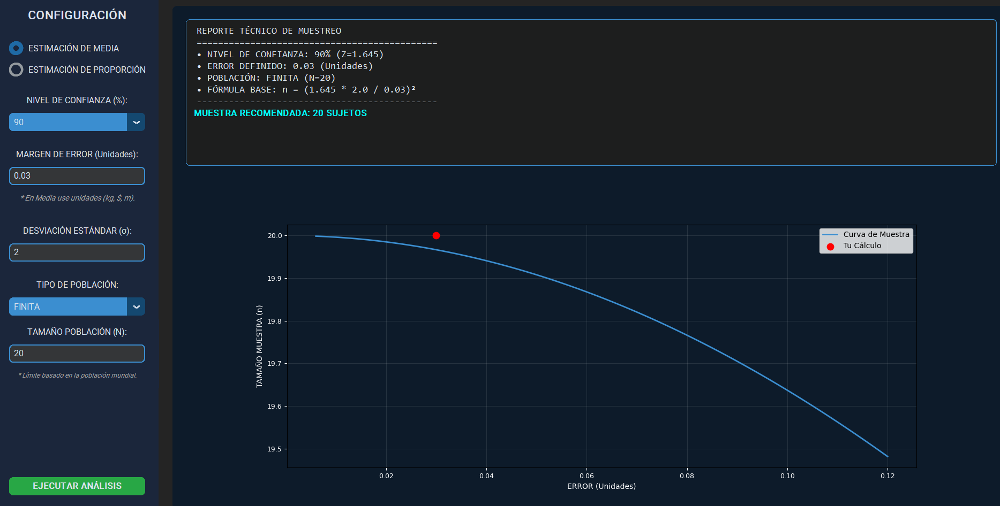
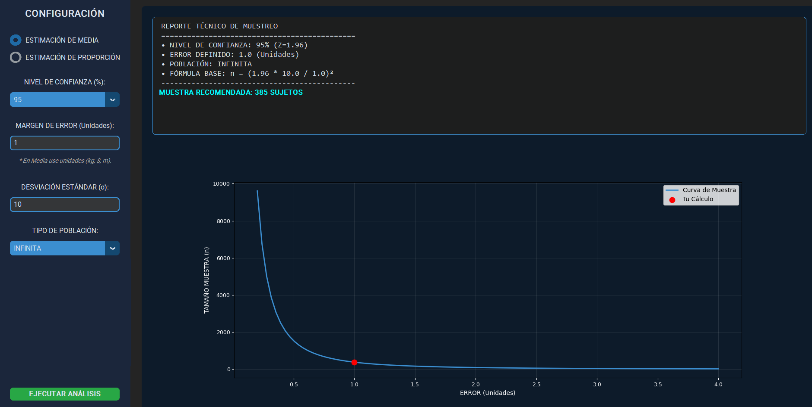

<div align="center">
<h2>
  
 INSTITUTO POLITÉCNICO NACIONAL    
  
</h2>
  
## ESCUELA SUPERIOR DE COMPUTO 
<br><br>

## PROYECTO TERMINAL  

<br>

# **README**  
## *Calculadora de Tamaño de Muestra y Margen de Error para la Planeación de Estudios*

<br>

### Para la asignatura  
### **Probabilidad y Estadística 26-1**

<br><br>

### **Presentan:**  
**Mendoza Castillo Alejandra**  
**Muñoz Orozpe Fernanda**

<br>

### **Grupo:** 4CM1  

<br><br>

### **Maestro:**  
**David Correa Coyac**

<br><br>

### **Fecha de entrega:**  
**8 de enero de 2026**

</div>

---

<br><br>

# Proyecto-Terminal
Calculadora de tamaño de muestra y margen de error para la planeación de estudios    
# Sistema de Planificación Estadística
## Calculadora de Tamaño de Muestra y Margen de Error

## Descripción
Este proyecto implementa un **sistema de planificación estadística** desarrollado en Python, orientado a la **determinación del tamaño de muestra** necesario para estudios de estimación de **medias** y **proporciones**.

La aplicación apoya la fase de diseño de investigaciones, permitiendo analizar la influencia del **nivel de confianza**, el **margen de error** y el **tipo de población**, complementado con una **visualización gráfica del análisis de sensibilidad**.

---

## Objetivo
Proporcionar una herramienta que permita:
- Calcular el tamaño de muestra óptimo.
- Evitar el uso ineficiente de recursos.
- Garantizar resultados estadísticamente confiables.

---

## Modelos Estadísticos Implementados

### Estimación de la Media
n = (Z · σ / E)²
### Estimación de la proporción
n = (Z² · p(1 − p)) / E²
### Ajuste por Población Finita (Cochran)
n_f = n / (1 + n / N)

Donde:
- **Z**: Valor crítico según el nivel de confianza  
- **E**: Margen de error  
- **σ**: Desviación estándar  
- **p**: Proporción estimada  
- **N**: Tamaño de la población  

---

## Funcionalidades
- Estimación de **media** y **proporción**
- Niveles de confianza: **90%, 95% y 99%**
- Manejo de **población infinita y finita**
- Validación de datos de entrada
- Generación de **reporte técnico**
- **Gráfica de análisis de sensibilidad**
- Interfaz gráfica moderna en **modo oscuro**

---

## Interfaz del Sistema
La aplicación cuenta con:
- Panel lateral de configuración
- Panel central con:
  - Resultados del análisis
  - Visualización gráfica del tamaño de muestra

---

## Requisitos
- Python **3.10 o superior**
- Librerías:
  - `tkinter`
  - `customtkinter`
  - `matplotlib`
  - `numpy`

---

## Instalación
1. Clona el repositorio:
```bash
git clone https://github.com/tu-usuario/tu-repositorio.git
```
2. Accede al directorio del proyecto:
```bash
cd tu-repositorio
```
3. Instala las dependencias:
```bash
pip install customtkinter matplotlib numpy
```

---

##  Ejecución
Ejecuta el archivo principal:
```bash
python main.py
```
---

## Ejemplo de Uso
1. Selecciona el tipo de estimación.
2. Define el nivel de confianza.
3. Ingresa el margen de error.
4. Introduce la desviación estándar o proporción.
5. Selecciona el tipo de población.
6. Ejecuta el análisis y revisa los resultados.
---

## Ejemplo 1 
1. Selecciona ESTIMACIÓN MEDIA
2. Nivel de confianza = 90
3. Margen de error = 0.03
4. Desviación estándar = 2
5. Tipo de población = FINITA
   5.1 Tamaño Poblacion = 20


---
## Ejemplo 2
1. Selecciona ESTIMACIÓN PROPORCIÓN
2. Nivel de confianza = 95
3. Margen de error = 0.001
4. Desviación estándar = 23
5. Tipo de población = FINITA
   5.1 Tamaño Poblacion = 30


---
## Ejemplo 3
1. Selecciona ESTIMACIÓN MEDIA
2. Nivel de confianza = 95
3. Margen de error = 1
4. Desviación estándar = 10
5. Tipo de población = INFINITA


---
## Conclusión 
Este proyecto demuestra que la correcta determinación del tamaño de muestra es clave para 
obtener inferencias estadísticas confiables. La aplicación evidencia la relación entre nivel
de confianza, margen de error y tamaño de muestra, así como la importancia del ajuste por 
población finita para optimizar estudios reales. La visualización del análisis de sensibilidad
apoya la toma de decisiones informadas en la planeación de investigaciones.

---
### Autores 
-Mendoza Castillo Alejandra 
-Muñoz Orozpe Fernanda 
Proyecto Terminal - Planeación de estudios estadísticos


